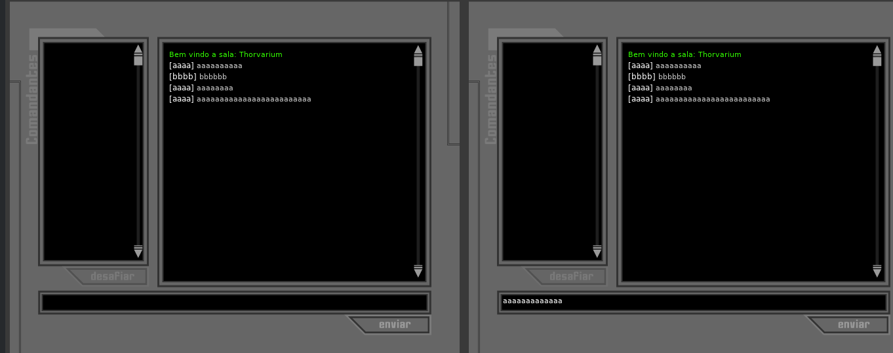

# [O projeto do MuriloucoLouco está bem mais avançado](https://github.com/MuriloucoLouco/thorvarium)

# thorvarium-reversing-server

A ideia aqui é estudar como o servidor funcionava para poder emular as respostas dele de acordo com o que o cliente esperava.
O princípio de funcionamento parece ser de um simples chat IRC.

# Como começar

- [Baixe o SWF original Aqui](http://web.archive.org/web/20040207015505mp_/http://tilttotal.globo.com/Conteudo/componentes/flash/flash_show/0,14463,869,00.swf)

- [Baixe o Local Content Updater e o Flash Player Projector](https://web.archive.org/web/20210102043330/https://www.adobe.com/support/flashplayer/debug_downloads.html)

- [Edite o arquivo /etc/hosts/](https://docs.rackspace.com/docs/modify-your-hosts-file) e adicione a linha "127.0.0.1 tf.globo.com"

- [Baixe o Node.js](https://nodejs.org/en/download/prebuilt-binaries) e siga o [tutorial](https://www.treinaweb.com.br/blog/instalacao-do-node-js-windows-mac-e-linux)

- [Baixe o decompilador de flash](https://github.com/jindrapetrik/jpexs-decompiler/releases/tag/version20.1.0)

- Use o Local Content Updater para permitir que o Thorvarium acesse a internet.

- Use o Flash Player Projector para rodar o arquivo SWF.

- O "/etc/hosts" serve para que as requisições ao server do jogo "tf.globo.com" sejam redirecionadas para sua própria máquina local

- Baixe esse repositório, abra um terminal na pasta e rode o servidor:
```
node index.js
```

- Execute o flashplayer e abra o arquivo SWF.

- Tente entrar no servidor e observe a saída do seu terminal.

- Caso tenha dado tudo certo, abra outra instancia do flashplayer e tente digitar algo no chat.

- O código de interesse é o `scripts/frame_133/DoAction.as`, para obtê-lo vc precisa abrir o SWF no decompilador e exportar os arquivos.

# Progresso até agora:

- Consegui apenas entrar na tela de chat e fazê-lo funcionar


